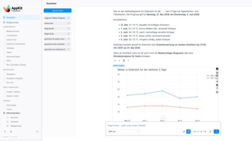
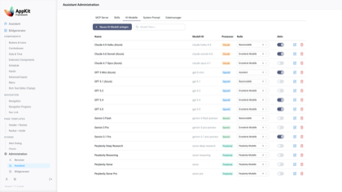
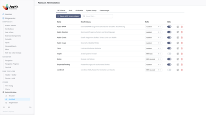
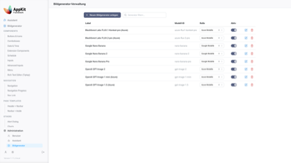
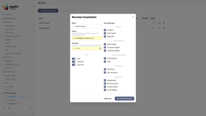
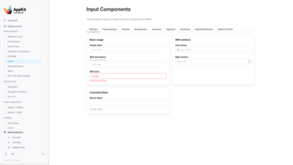
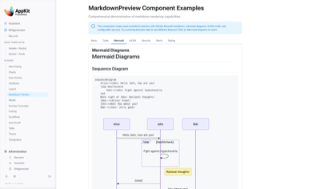
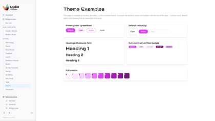
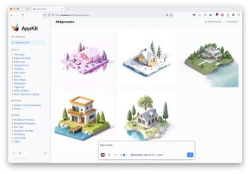

<!-- markdownlint-disable MD033 MD041 -->
<div align="center">

<p>&nbsp;</p>
<p>A production-ready Reflex application framework with Mantine UI components,<br />
enterprise authentication, AI assistants, image generation, and built-in MCP servers.</p>

<p>
<a href="https://www.python.org/"></a>
<a href="https://reflex.dev/"></a>
<a href="https://mantine.dev/"></a>
<a href="./pyproject.toml"></a>
</p>

<p>
<a href="#overview">Overview</a> |
<a href="#screenshots">Screenshots</a> |
<a href="#packages">Packages</a> |
<a href="#getting-started">Getting Started</a> |
<a href="#configuration">Configuration</a> |
<a href="#development">Development</a>
</p>
</div>
<!-- markdownlint-enable MD033 MD041 -->

## Overview

AppKit is a modular Python workspace for building authenticated, AI-enabled Reflex applications. The repository contains both a runnable application and reusable packages for Mantine-based UI, user management, assistants, image generation, shared infrastructure, and Model Context Protocol (MCP) servers.

The current app combines:

- **Mantine UI for Reflex** with typed components, examples, forms, tables, navigation, overlays, rich text editing, charts, and page templates.
- **Enterprise user management** with OAuth login, sessions, role-based access control, profile pages, password reset flows, and admin screens.
- **AI assistant workflows** with model management, file upload support, MCP app integration, slash-command style prompts, and configurable providers.
- **Image generation** with multiple generator backends, galleries, cleanup jobs, and admin-managed generator configuration.
- **MCP servers** for user analytics, chart generation, BPMN diagrams, and image generation, mounted into the FastAPI backend.
- **Production infrastructure** with SQLAlchemy 2.0, Alembic migrations, Pydantic settings, encrypted configuration values, PostgreSQL scheduling via PGQueuer, Docker support, and structured logging.

> [!NOTE]
> AppKit is both an application and a set of reusable workspace packages. You can run the full app locally or depend on individual packages such as `appkit-mantine` in another Reflex project.

## Screenshots

Small previews are shown below. See the [full-size screenshot gallery](./docs/SCREENSHOTS.md) for the complete images.

| Screenshot | Screenshot | Screenshot |
| --- | --- | --- |
| Assistant workspace | LLM model management | MCP server management |
| [](./docs/SCREENSHOTS.md#assistant-workspace) | [](./docs/SCREENSHOTS.md#llm-model-management) | [](./docs/SCREENSHOTS.md#mcp-server-management) |
| Image model management | User management modal | Mantine input examples |
| [](./docs/SCREENSHOTS.md#image-model-management) | [](./docs/SCREENSHOTS.md#user-management-modal) | [](./docs/SCREENSHOTS.md#mantine-input-examples) |
| Markdown preview example | Theme example | Image creator |
| [](./docs/SCREENSHOTS.md#markdown-preview-example) | [](./docs/SCREENSHOTS.md#theme-example) | [](./docs/SCREENSHOTS.md#image-creator) |

## Packages

| Package | Purpose |
| --- | --- |
| [`appkit-mantine`](./components/appkit-mantine) | Mantine 9 components for Reflex with typed Python wrappers and example pages. |
| [`appkit-ui`](./components/appkit-ui) | Shared layout, templates, and navigation helpers for AppKit-style applications. |
| [`appkit-user`](./components/appkit-user) | Authentication, sessions, RBAC, profile management, password reset, and user admin. |
| [`appkit-assistant`](./components/appkit-assistant) | AI assistant UI and backend services with model registry, MCP integration, and file cleanup. |
| [`appkit-imagecreator`](./components/appkit-imagecreator) | Image generation workflows, galleries, generator registry, and generated-image cleanup. |
| [`appkit-commons`](./components/appkit-commons) | Configuration, registry, database entities, repositories, encryption helpers, middleware, and scheduler support. |
| [`appkit-mcp-commons`](./components/appkit-mcp-commons) | Shared MCP server utilities. |
| [`appkit-mcp-user`](./components/appkit-mcp-user) | MCP server for user analytics and user-management context. |
| [`appkit-mcp-charts`](./components/appkit-mcp-charts) | MCP server for chart and visualization generation. |
| [`appkit-mcp-bpmn`](./components/appkit-mcp-bpmn) | MCP server for BPMN 2.0 workflow diagram generation. |
| [`appkit-mcp-image`](./components/appkit-mcp-image) | MCP server for authenticated image generation and editing. |

## Getting Started

### Prerequisites

- Python 3.13 or newer
- [uv](https://docs.astral.sh/uv/)
- [Task](https://taskfile.dev/)
- PostgreSQL for the full application
- Docker, optional, for containerized runs

### Run Locally

```bash
git clone https://github.com/jenreh/appkit.git
cd appkit

task init
task run
```

The development app starts at `http://localhost:8080/` with the backend on `http://localhost:3030`.

If the database is already configured and dependencies are installed, the shorter loop is:

```bash
task sync
task db:upgrade
task run
```

> [!IMPORTANT]
> The full app expects database and secret-backed configuration values. For local development, review `configuration/config.yaml` and `configuration/config.local.yaml`, then provide the required secret values through your configured AppKit secret provider or environment overrides.

### Use `appkit-mantine` Separately

```bash
uv add appkit-mantine
```

```python
import reflex as rx
import appkit_mantine as mn


class DemoState(rx.State):
    value: str = ""


def index() -> rx.Component:
    return mn.container(
        mn.input(
            label="Prompt",
            placeholder="Type something...",
            value=DemoState.value,
            on_change=DemoState.set_value,
        ),
    )


app = rx.App()
app.add_page(index)
```

## Configuration

AppKit uses profile-based YAML configuration with environment-specific overrides:

| File | Purpose |
| --- | --- |
| [`configuration/config.yaml`](./configuration/config.yaml) | Default app, Reflex, database, authentication, assistant, image generator, and MCP settings. |
| [`configuration/config.local.yaml`](./configuration/config.local.yaml) | Local development overrides. |
| [`configuration/config.docker_test.yaml`](./configuration/config.docker_test.yaml) | Docker test profile. |
| [`configuration/config.prod.yaml`](./configuration/config.prod.yaml) | Production profile. |
| [`configuration/logging.yaml`](./configuration/logging.yaml) | Development logging configuration. |
| [`configuration/logging.prod.yaml`](./configuration/logging.prod.yaml) | Production logging configuration. |

The application registers the FastAPI backend, image API routes, MCP app routes, HTTPS middleware, AI model registry, image generator registry, and scheduled cleanup services during startup.

## Development

Common commands are defined in [`Taskfile.dist.yml`](./Taskfile.dist.yml):

| Command | Description |
| --- | --- |
| `task` | Show available tasks. |
| `task init` | Install Python, sync dependencies, install pre-commit hooks, and run migrations. |
| `task sync` | Install workspace dependencies with uv. |
| `task run` | Start the Reflex development app. |
| `task run:debug` | Start the app with debug logging. |
| `task run:prod` | Start the app in production mode on a single port. |
| `task test` | Run pytest with coverage. |
| `task lint` | Run Ruff checks. |
| `task format` | Apply Ruff fixes and formatting. |
| `task db:revision -- "message"` | Create a manual Alembic revision. |
| `task db:upgrade` | Apply migrations. |
| `task docker:build` | Build the Docker image locally. |
| `task docker:test` | Run and verify the local Docker image with Compose. |

> [!WARNING]
> Do not create Alembic migrations with autogeneration for this repository. Write migrations manually and verify the current migration chain before applying them.

## Project Layout

```text
appkit/
├── app/                       # Main Reflex application, pages, navbar, and app startup
├── components/                # uv workspace packages
├── configuration/             # YAML profiles and logging config
├── alembic/                   # Database migrations
├── assets/                    # Static assets, icons, CSS, email templates, image styles
├── docs/images/               # README screenshots
├── tests/                     # Root-level test helpers
├── Dockerfile                 # Production image build
├── docker-compose.yml         # Local container runtime
├── pyproject.toml             # Root package and uv workspace config
└── Taskfile.dist.yml          # Development task runner
```

## Runtime Surface

- Reflex frontend: `http://localhost:8080/`
- Backend API: `http://localhost:3030`
- MCP servers mounted under the backend for `/user`, `/charts`, `/bpmn`, and `/image`
- Authenticated app routes include `/assistant`, `/image-gallery`, `/profile`, `/admin/users`, `/admin/assistant`, and `/admin/image-generators`

## Resources

- [Reflex documentation](https://reflex.dev/docs/)
- [Mantine documentation](https://mantine.dev/)
- [Model Context Protocol](https://modelcontextprotocol.io/)
- [SQLAlchemy documentation](https://docs.sqlalchemy.org/)
- [Alembic documentation](https://alembic.sqlalchemy.org/)
