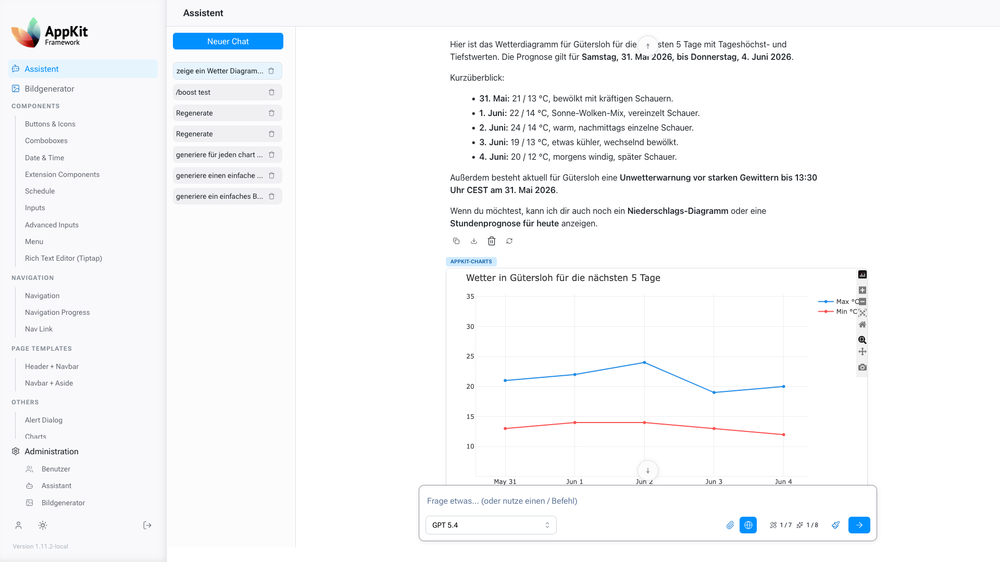
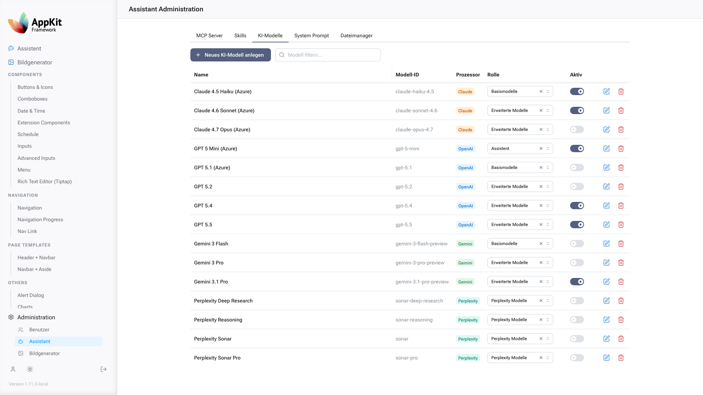
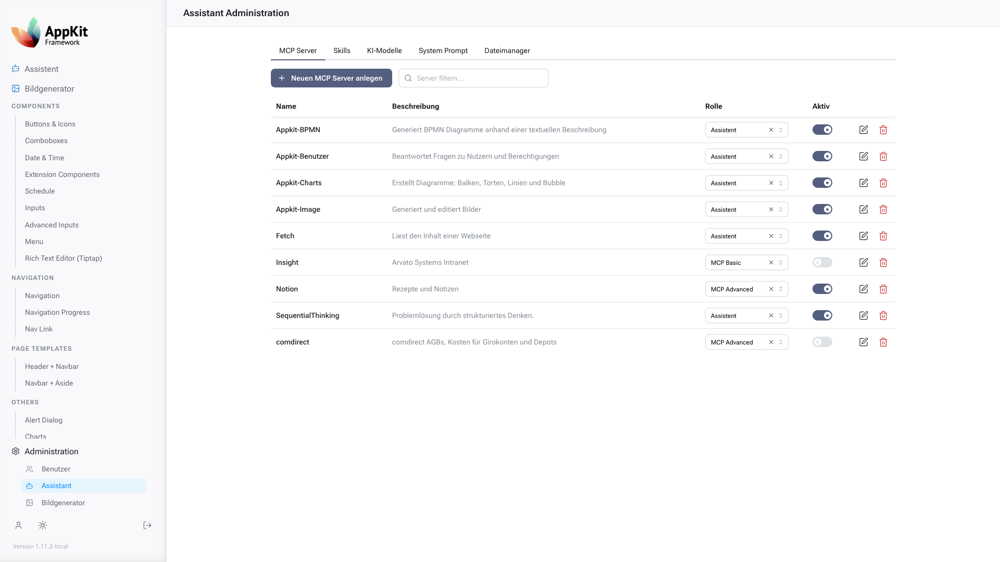
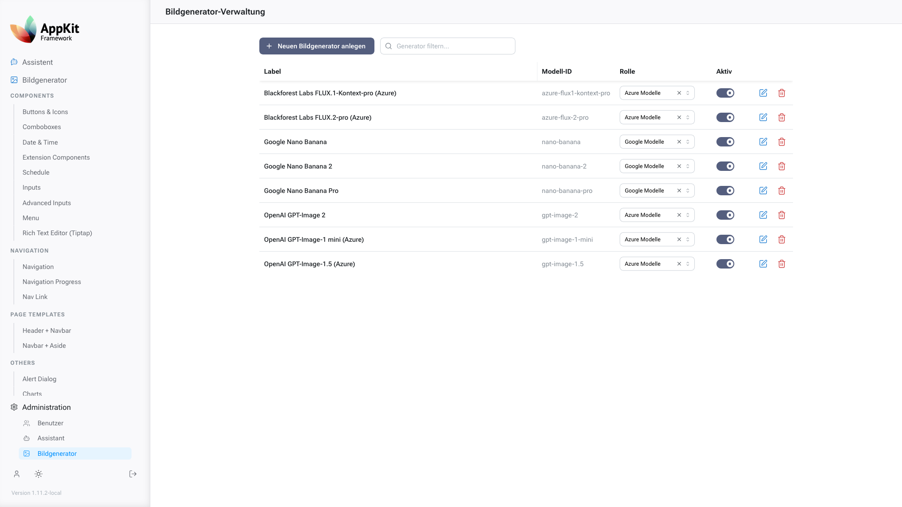
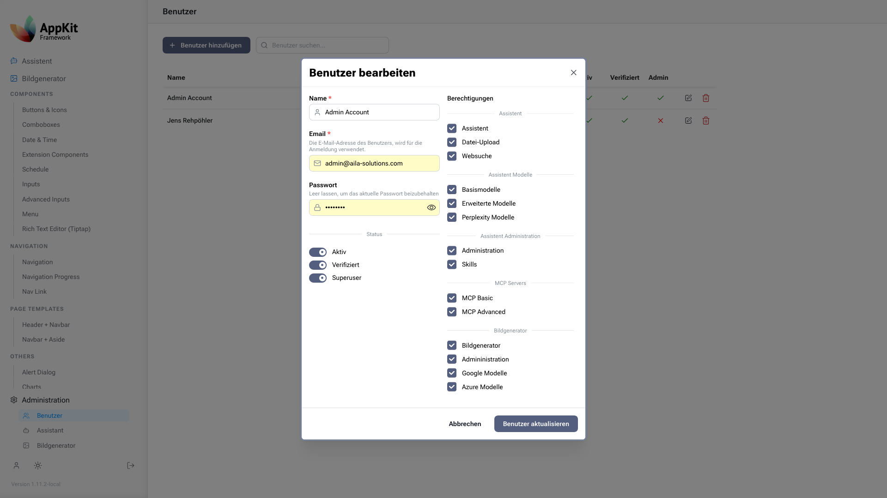
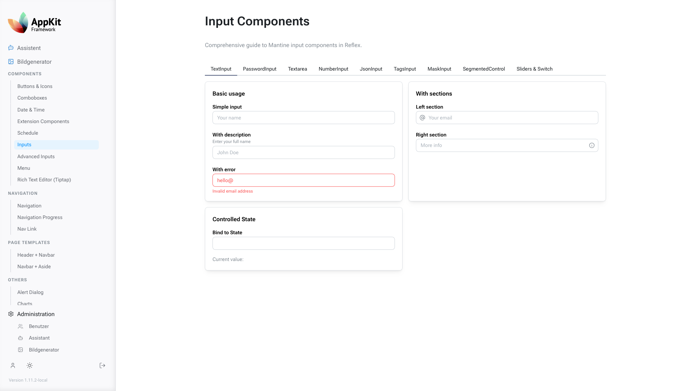
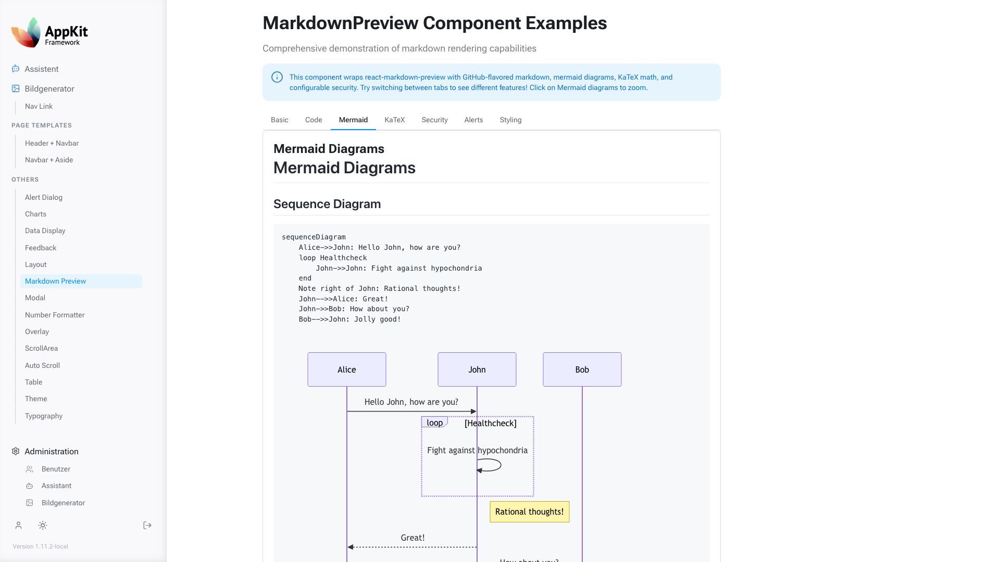
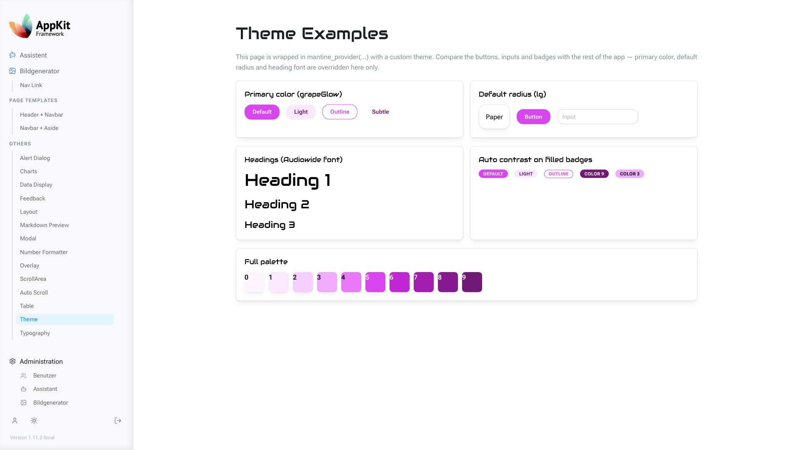
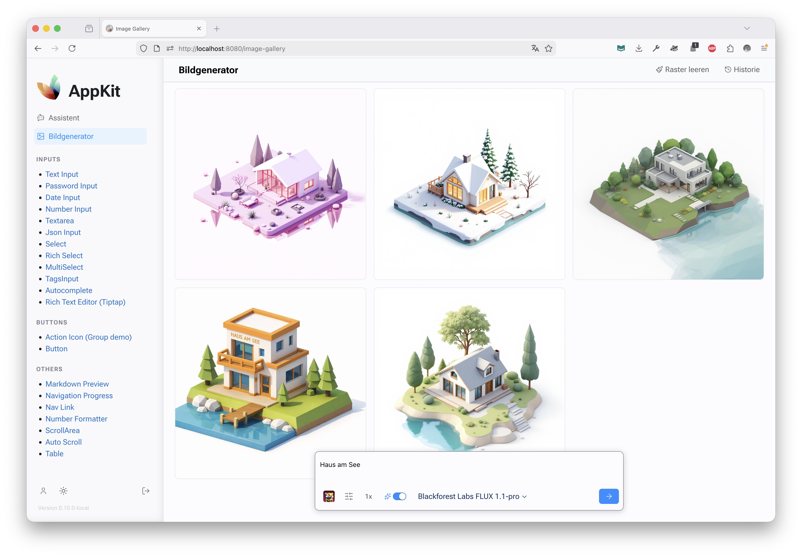

# AppKit Screenshots

Full-size screenshots for the README thumbnail gallery.

[Back to README](../README.md#screenshots)

## Assistant Workspace

Title: Assistant workspace

## LLM Model Management

Title: LLM model management

## MCP Server Management

Title: MCP server management

## Image Model Management

Title: Image model management

## User Management Modal

Title: User management modal

## Mantine Input Examples

Title: Mantine input examples

## Markdown Preview Example

Title: Markdown preview example

## Theme Example

Title: Theme example

## Image Creator

Title: Image creator
